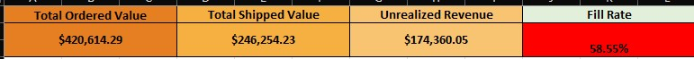
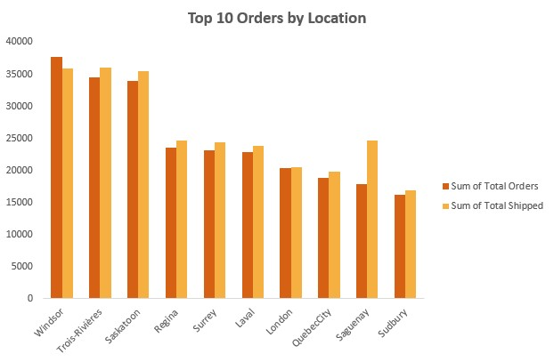
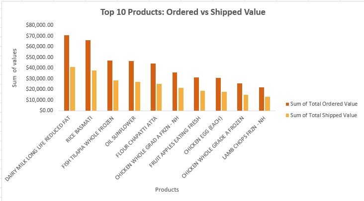

# Distribution Center Order Fulfillment & Revenue Impact Analysis

## Project Overview

This project analyzes four weeks of distribution center order and shipment data to evaluate product demand, fulfillment performance, and revenue impact.

## Objectives

- Identify top-demand products
- Measure fulfillment performance
- Calculate revenue gaps
- Provide recommendations to improve supply chain efficiency

## Tools Used

- Microsoft Excel
- Pivot Tables
- Pivot Charts
- XLOOKUP
- SUMIFS
- Conditional Formatting
- Dashboard Design

## Key Metrics

- Total Ordered Value
- Total Shipped Value
- Fill Rate
- Revenue Gap

## Dashboard

## Key Findings

- Top 10 products generated $420.6K in demand.
- Only $246.3K was shipped.
- Overall fill rate was 58.6%.
- Revenue gap reached approximately $174.4K.

## Recommendations

- Improve inventory planning.
- Monitor fulfillment performance.
- Investigate causes of unfulfilled orders.
- Optimize inventory allocation across distribution centers.
